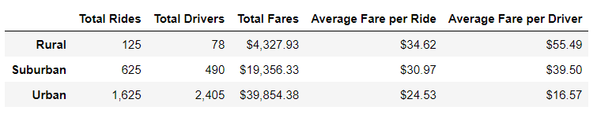
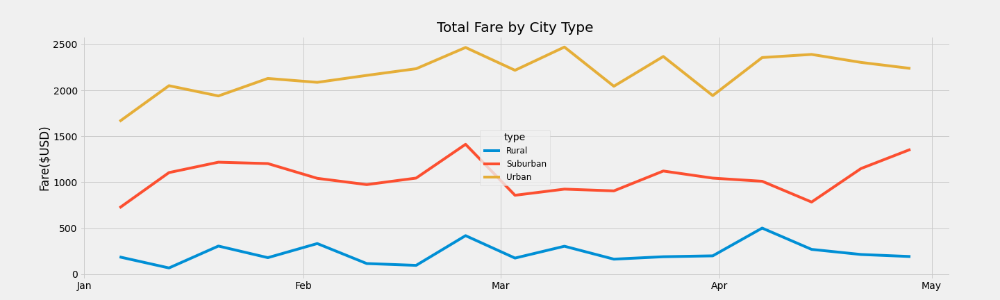

# **PyBer Analysis**

## **Purpose**
Use Python, Pandas, and Matplotlib to analyze how the data differs by city type and how those differences can be used by decision-makers at PyBer (a ride sharing company). This will be accomplished through the following deliverables:

- Summary DataFrame of the ride-sharing data by city type.
- Multi-line graph that shows the total weekly fares for each city type.
- Written report that summarizes the data.

 

## **Results**

### Summary Data Frame Analysis
- As we move from rural to urban there is more availability of drivers and more rides performed. However, the fare per driver and per ride decreases. 
- In urban cities there are more total drivers than there are total rides.
- Total fare revenue is highest in Urban cities, then Suburban and lastly Rural cities.
 
 

Figure 1

 

### Weekly Fares per City Graph Analysis
- The total weekly fares remains relatively stable, meaning there is no large fluctuation in total weekly fare, for each city type from January through the end of April. 
- There is one single point of trend between the three city types at the end of February where all three city types see an increase in the total fare for that week. 
- While, overall, weekly fare is relatively stable, urban cities see the largest fluctuation in total weekly fare between the three city types.

 

Figure 2

## **Summary**
Based on the results, there are some disparities between the different city types. The following are recommendations provided to potentially address these disparities. Please note that recommendations are based on available data generated during this analysis and further data would be needed to make concrete business decisions.

### Recommendations:
1. Reduce the amount of drivers in urban cities as there is an oversupply of them. Doing so may increase average fare per ride and per driver. 
2. Increase the amount of drivers in suburban and rural cities as they may be under serviced. This could reduce average fares and potentially increase total fares as a larger supply could lead to more total rides.
3. Reduce the cost per unit of distance as you move from urban to rural to redue aver fares and potentially increase total rides.

